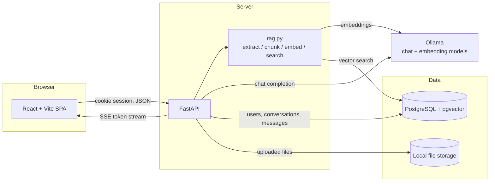

# MitraAI

A self-hosted AI chat application that answers questions from your own documents, using a local
LLM. No third-party AI API, no API key in the browser, no data leaving the machine it runs on.

## Problem

Most AI chat tools require sending your documents and conversations to a hosted provider, and most
"chat with your PDF" demos call a paid embedding API from the browser with the key embedded in the
bundle. MitraAI is the opposite: every model call — chat and embeddings — happens on a local
Ollama instance reached only by the backend, and every document, message and vector stays in your
own PostgreSQL database.

## Key features

- Email + password accounts with server-side sessions in an HttpOnly cookie
- Persistent conversations and messages, scoped strictly to their owner
- Token-by-token streaming over Server-Sent Events, with a working stop/cancel
- Upload PDF, TXT and Markdown documents; text is extracted, chunked and embedded locally
- Semantic retrieval with pgvector, filtered to the requesting user's own documents
- Grounded answers with citations (filename and page) persisted alongside the assistant message
- Light/dark theme, responsive layout, keyboard-accessible controls

## Architecture



The browser never talks to Ollama. `OLLAMA_BASE_URL` and the model names are server-side
configuration and never appear in the frontend bundle.

### Frontend stack

React 19, TypeScript, Vite, Tailwind CSS v4. No state-management or data-fetching library — a
single `services/api.ts` module wraps `fetch`, and the SSE stream is parsed from
`response.body` with a `ReadableStream` reader so the request can carry a session cookie and be
aborted with an `AbortController`.

### Backend stack

FastAPI, Pydantic v2 and pydantic-settings, SQLAlchemy 2.x async with the asyncpg driver, Alembic
for migrations, bcrypt for password hashing, pypdf for PDF text extraction.

### PostgreSQL

Five tables: `users`, `sessions`, `conversations`, `messages`, `documents`, `document_chunks`. All
primary keys are UUIDs, all rows carry timestamps, and every foreign key cascades on delete so
removing a user or a document removes everything derived from it. Citations are stored on
`messages.sources` as JSONB.

### pgvector

`document_chunks.embedding` is a fixed `vector(768)` column with an HNSW index using
`vector_cosine_ops`. Similarity search runs in the database as `1 - cosine_distance`, joined to
`documents` and filtered by `user_id` so the user filter is part of the query itself.

### Ollama

Two local models: a chat model (`OLLAMA_MODEL`) and an embedding model (`OLLAMA_EMBED_MODEL`).
Chat uses `/api/chat` with `stream: true`; embeddings use `/api/embed` in batches of at most
`EMBED_BATCH_SIZE`. Provider failures are logged server-side and returned to the client as a
generic "The AI service is unavailable." so no host, port or model name leaks.

### Streaming architecture

`POST /api/conversations/{id}/chat` returns `text/event-stream`. The user message is persisted
before streaming begins, then the endpoint emits:

| Event | Payload |
| --- | --- |
| `user_message` | the persisted user message |
| `sources` | retrieved citations, when any cleared the threshold |
| `token` | one chunk of the model's reply |
| `done` | the persisted assistant message, including its sources |
| `error` | a client-safe message |

The assistant message is written only when generation completes. If the client disconnects, the
generator is closed and nothing partial is stored.

### Document processing

Upload is synchronous — there is no queue or worker. The request validates the extension and size,
stores the bytes under a generated UUID (never a client-supplied filename), then extracts, chunks
and embeds:

1. Extract text per page (`MAX_PDF_PAGES` cap; TXT and Markdown have no page number)
2. Chunk into `CHUNK_CHARS` windows overlapping by `CHUNK_OVERLAP_CHARS`, capped at
   `MAX_DOCUMENT_CHUNKS`, numbered continuously and tagged with their page
3. Embed in batches of `EMBED_BATCH_SIZE`
4. Store chunks with their vectors and mark the document `ready`

A file that yields no usable text is marked `failed` and the request returns 422 — a document is
never reported `ready` with zero chunks.

### RAG pipeline

On each chat request the question is embedded and searched against the user's own `ready`
documents. Chunks scoring at or above `RAG_SIMILARITY_THRESHOLD` (top `RAG_TOP_K`) are formatted
into a system prompt that fences them between `<<<EXCERPTS>>>` markers and declares them untrusted
data, instructing the model to ignore any directions inside them and to say it could not find the
answer rather than invent one. With no qualifying chunks, no system prompt is added and the chat
behaves as an ordinary assistant.

### Authentication

Signup and login hash passwords with bcrypt and create a session row storing only a SHA-256 digest
of the session token, so a database leak cannot be replayed as a cookie. The token goes to the
browser in an HttpOnly, SameSite=Lax cookie (`COOKIE_SECURE=true` for HTTPS). Every private
endpoint depends on `get_current_user`, and conversation and document routes additionally compare
the row's `user_id` to the caller.

## Local setup

Requires Python 3.13+, Node 22+, a PostgreSQL 16 with the `vector` extension available, and
Ollama.

```bash
# models
ollama pull qwen2.5:0.5b
ollama pull nomic-embed-text

# backend
cd backend
python3 -m venv .venv && .venv/bin/pip install -r requirements.txt
cp .env.example .env          # edit DATABASE_URL
.venv/bin/alembic upgrade head
.venv/bin/uvicorn app.main:app --reload

# frontend (in another shell, from the repo root)
npm install
npm run dev                   # http://localhost:5173, proxies /api to port 8000
```

## Docker setup

```bash
docker compose up --build
# then pull the models into the ollama service
docker compose exec ollama ollama pull qwen2.5:0.5b
docker compose exec ollama ollama pull nomic-embed-text
```

The frontend is served on <http://localhost:5173> and proxies `/api` to the backend. PostgreSQL
data and Ollama models persist in named volumes; the backend runs `alembic upgrade head` on start.

## Environment variables

All backend settings, with their defaults (see `backend/.env.example`):

| Variable | Default | Purpose |
| --- | --- | --- |
| `DATABASE_URL` | — (required) | async PostgreSQL DSN |
| `CORS_ORIGIN` | `http://localhost:5173` | allowed browser origin |
| `SESSION_COOKIE_NAME` | `mitraai_session` | session cookie name |
| `SESSION_TTL_DAYS` | `7` | session lifetime |
| `COOKIE_SECURE` | `false` | must be `true` behind HTTPS |
| `OLLAMA_BASE_URL` | `http://127.0.0.1:11434` | local Ollama endpoint |
| `OLLAMA_MODEL` | `qwen2.5:0.5b` | chat model |
| `OLLAMA_EMBED_MODEL` | `nomic-embed-text` | embedding model (768 dimensions) |
| `CHAT_CONTEXT_MESSAGES` | `20` | recent messages sent as context |
| `CHAT_REQUESTS_PER_MINUTE` | `20` | per-user chat rate limit |
| `UPLOAD_DIR` | `var/uploads` | local file storage |
| `MAX_UPLOAD_BYTES` | `10485760` | upload size limit |
| `MAX_PDF_PAGES` | `200` | pages read per PDF |
| `MAX_DOCUMENT_CHUNKS` | `500` | chunks stored per document |
| `EMBED_BATCH_SIZE` | `32` | texts per embedding request |
| `CHUNK_CHARS` / `CHUNK_OVERLAP_CHARS` | `1000` / `150` | chunk window and overlap |
| `RAG_TOP_K` | `5` | chunks retrieved |
| `RAG_SIMILARITY_THRESHOLD` | `0.6` | minimum cosine similarity |

The embedding column is a fixed `vector(768)`. Switching to a model with different dimensions
requires a new migration.

## Testing

```bash
cd backend && DATABASE_URL=... .venv/bin/pytest -q   # needs PostgreSQL with pgvector
npm test                                             # frontend, jsdom
npm run lint && npm run typecheck && npm run build
```

Backend tests run against a real PostgreSQL database and mock only Ollama, so extraction,
chunking, batching, vector search, ownership isolation and SSE framing are exercised for real.
CI runs both suites on every push and pull request.

## Known limitations

- Document indexing is synchronous inside the upload request; a large PDF blocks that request.
- The rate limiter keeps counters in process memory, so it does not hold across multiple workers.
- No OCR: a scanned, image-only PDF yields no text and is rejected as unreadable.
- Chunking is fixed-size character windows with no sentence or semantic awareness, and there is no
  reranking.
- Conversation context is the last N messages with no token accounting, so long messages can still
  overflow the model's window.
- `RAG_SIMILARITY_THRESHOLD` was tuned against `nomic-embed-text` on a small sample; a different
  embedding model will need a different value.
- Uploaded files are stored on the local filesystem, so the backend is not horizontally scalable
  as-is.
- Cancelling a generation discards the partial reply rather than saving it.
- No password reset, email verification, OAuth, or roles.

## Future improvements

- Move indexing to a background task so uploads return immediately with a `processing` status
- Sentence-aware chunking and a reranking pass over retrieved chunks
- Token-budgeted conversation context instead of a fixed message count
- Shared-state rate limiting and object storage for uploads, for multi-instance deployment
- Per-conversation document scoping, so a chat can be limited to chosen documents
- An end-to-end browser test covering signup through citation-after-reload
